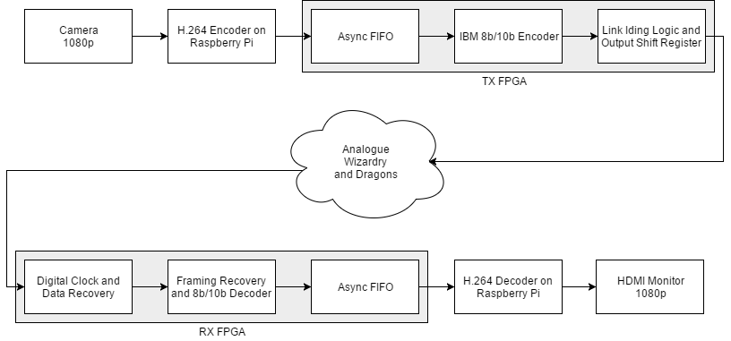
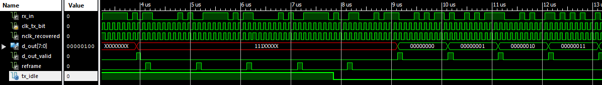

Fibre Optic FPGA
================

We built (in a small team) a 10Mbps fibre optic link for a CUED 3rd year project. The other two members worked mostly on the analogue electronics side; on the digital side, we had an FPGA at each end doing

- Line coding (IBM 8b/10b) to aid clock recovery and remove data DC bias
- Link idling/symbol reframing with 8b/10b comma sequences
- Digital clock and data recovery
- Simple parallel bus + FIFO interface connected to TX and RX modules, exposed on IO pins

The chosen link application was CCTV. A Raspberry Pi encodes the output of a camera as 1080p h.264 video, in real time. A simple userspace program bitbashes this into the FPGA's TX FIFO. The process is reversed at the other end of the link, and live 1080p video is displayed via HDMI.

Directories
-----------

- `numato`
	- Documentation and programming utilities for the FPGA dev boards, so I can get started quickly after `git clone`ing from a new machine.
- `raspberry_pi`
	- Source for userspace program which connects a stdin/stdout to the RX/TX FIFO via GPIO. Busy wait is used to implement the flow control, so this requires a multicore Pi to work well.
	- Can use a single bash command e.g. `dd if=/dev/urandom | tee test_vector.bin | ./bitbash` to pipe any program's output onto link. This is great for testing.
- `src`
	- Verilog source for all the non-IP FPGA hardware.
- `tx_proj`, `rx_proj`
	- Xilinx project/configuration files, Xilinx IP files (e.g. PLLs and FIFOs), FPGA configuration bitstreams, and any temp files I didn't manage to cover with .gitignore.
	- Both projects share the same `src` directory, to facilitate testbenches involving both RX and TX hardware.
